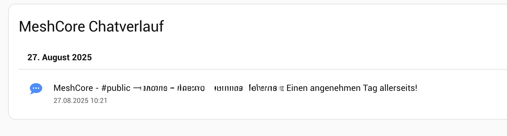

# meshcore-ha-chatlog
Simple script to log chat messages from Meshcore when using HA integration. 

How to install and use:

1. Ensure you have „Meshcore-HA“ integration installed and working: https://github.com/meshcore-dev/meshcore-ha
2. `Adjust („#####")` and paste the below snippet into your `automations.yaml`. Parts you need to edit:
 - `id`: id if the automation, can be random number
 - `notify.#####`: adjust to fit your mobile device that you use to receive push-notifications
 - `logbook.log`: adjust if you need another filename	
```yaml
- id: '#####'
  alias: Meshcore Forward to Push (+Log)
  description: Forwards all MeshCore messages to a push notification & logbook
  triggers:
    - trigger: event
      event_type: meshcore_message
  actions:
    - action: notify.##### 
      data:
        message: >-
          
            Channel {{ trigger.event.data.channel }}: {{ trigger.event.data.sender_name }}: {{ trigger.event.data.message }}
          
            {{ trigger.event.data.sender_name }}: {{ trigger.event.data.message }}
          
    - action: logbook.log
      data:
        name: "MeshCore"
        message: >-
          
            #{{ trigger.event.data.channel }} — {{ trigger.event.data.sender_name }}: {{ trigger.event.data.message }}
          
            {{ trigger.event.data.sender_name }}: {{ trigger.event.data.message }}
          
        entity_id: sensor.meshcore_feed
  mode: single
  ```
  3. Insert below code into your `template.yaml` (or adjust if you use another way), ensure to have correct indentation, possibly you need to adjust code if you already have a `template:` section:
```yaml
template:
  - sensor:
      - name: "MeshCore Feed"
        state: "ok"
        unique_id: meshcore_feed
  ```        
  4. Install `logbook-card` via HACS and paste the code below wherever you need it, adjust columns and rows to your own needs:
```yaml
type: grid
cards:
  - type: custom:logbook-card
    title: MeshCore Chatverlauf
    entity: sensor.meshcore_feed
    show_history: false
    custom_logs: true
    group_by_day: true
    date_format: DD.MM.YYYY HH:mm
    max_items: 300
    scroll: true
    custom_log_map:
      - name: MeshCore
        icon: mdi:chat-processing
        icon_color: "#4f8ef7"
    grid_options:
      columns: 36
      rows: 5
column_span: 3
```
It should look like this:   

